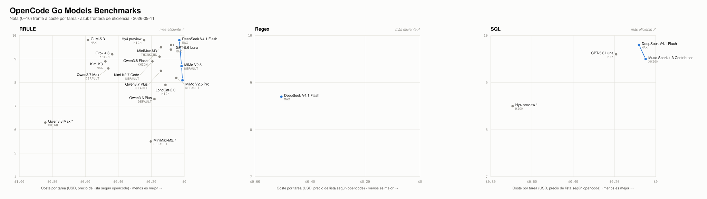
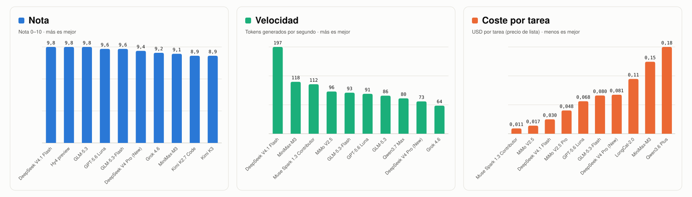
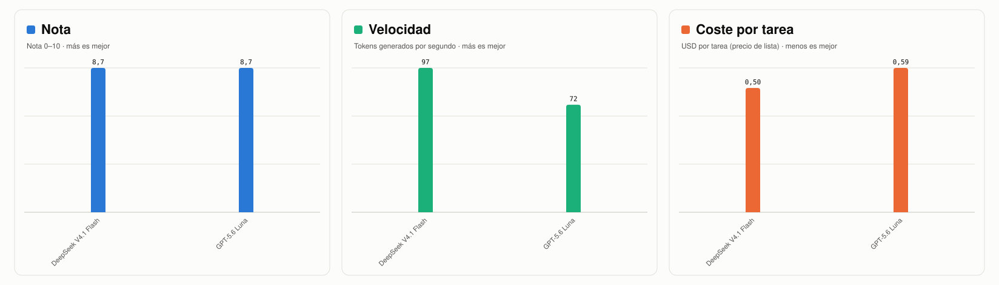
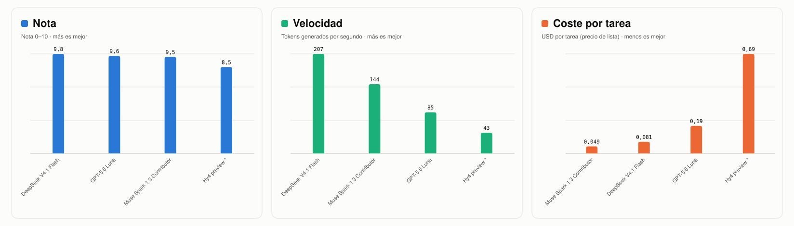

# OpenCode Go Models Benchmarks

[](https://github.com/rldona/opencode-models-benchmarks/actions/workflows/tests.yml)
[](https://github.com/rldona/opencode-models-benchmarks/actions/workflows/reports.yml)
[](https://rldona.github.io/opencode-models-benchmarks/)
[](https://rldona.github.io/opencode-models-benchmarks/#rrule)
[](https://rldona.github.io/opencode-models-benchmarks/#regex)
[](https://rldona.github.io/opencode-models-benchmarks/#sql)
 

<a href="https://rldona.github.io/opencode-models-benchmarks/"><picture><source media="(prefers-color-scheme: dark)" srcset="assets/cover-dark.svg"></picture></a>

**[Web interactiva](https://rldona.github.io/opencode-models-benchmarks/)**: gráfico de nota frente a coste, tokens, pasos o tiempo, con la frontera de eficiencia, y la clasificación con los **pesos de la nota ajustables** (corrección, autonomía, tests, código y robustez).

Cada modelo de opencode-go resuelve la misma tarea en autopiloto, aislado en su carpeta y con su variante de razonamiento más alta. La nota 0–10 combina una suite de tests oculta, la valoración de un juez (código y tests), la autonomía y la robustez. La suite oculta no se publica para que siga siendo válida en futuras tiradas.

## Resultados

### RRULE · 20 de 20 modelos con nota

Expansor de eventos recurrentes (subconjunto de RRULE: DAILY/WEEKLY/MONTHLY, INTERVAL, BYDAY con 2TU/-1FR, COUNT, UNTIL) en TypeScript + Vitest, respetando la hora local con zonas IANA y cambios de hora.

<picture><source media="(prefers-color-scheme: dark)" srcset="assets/highlights-rrule-dark.svg"></picture>

| # | Modelo | Variante | Nota | Suite oculta | Código | Tests | Coste | Tiempo |
|---|---|---|---|---|---|---|---|---|
| 1 | DeepSeek V4.1 Flash | `max` | **9,8** | 19/19 | 9 | 9 | $0,0300 | 3m 30s |
| 2 | Hy4 preview | `high` | **9,8** | 19/19 | 9 | 9 | $0,24 | 12m 29s |
| 3 | GLM-5.3 | `max` | **9,8** | 19/19 | 9 | 9 | $0,58 | 15m 20s |
| 4 | GPT-5.6 Luna | `max` | **9,6** | 19/19 | 9 | 9 | $0,0677 | 6m 12s |
| 5 | GLM-5.3-Flash | `max` | **9,6** | 19/19 | 8 | 9 | $0,0797 | 10m 32s |
| 6 | Qwen3.8 Flash | `xhigh` | **9,5** | 18/19 | 9 | 9 | $0,14 | 26m 02s |
| 7 | DeepSeek V4 Pro (New) | `max` | **9,4** | 19/19 | 8 | 8 | $0,0813 | 6m 47s |
| 8 | Grok 4.6 | `xhigh` | **9,2** | 19/19 | 8 | 7 | $0,44 | 7m 56s |
| 9 | MiniMax-M3 | `thinking` | **9,1** | 17/19 | 8 | 8 | $0,15 | 6m 49s |
| 10 | Kimi K2.7 Code | `default` | **8,9** | 18/19 | 7 | 8 | $0,19 | 8m 41s |
| 11 | Kimi K3 | `max` | **8,9** | 16/19 | 8 | 9 | $0,48 | 11m 00s |
| 12 | MiMo V2.5 | `default` | **8,7** | 16/19 | 7 | 8 | $0,0168 | 5m 11s |
| 13 | Qwen3.7 Max | `default` | **8,6** | 17/19 | 7 | 6 | $0,46 | 4m 45s |
| 14 | Qwen3.7 Plus | `default` | **8,5** | 17/19 | 6 | 7 | $0,14 | 7m 30s |
| 15 | MiMo V2.5 Pro | `default` | **8,2** | 13/19 | 8 | 8 | $0,0485 | 7m 33s |
| 16 | Muse Spark 1.3 Contributor | `xhigh` | **8,1** | 14/19 | 7 | 8 | $0,0110 | 3m 41s |
| 17 | LongCat-2.0 | `high` | **7,9** | 17/19 | 4 | 6 | $0,11 | 20m 53s |
| 18 | Qwen3.6 Plus | `default` | **7,3** | 13/19 | 5 | 7 | $0,18 | 4m 15s |
| 19 | Qwen3.8 Max\* | `xhigh` | **6,3**\* | 19/19 | 9 | 0 | $0,84 | 28m 30s |
| 20 | MiniMax-M2.7 | `default` | **5,5** | 9/19 | 6 | 6 | $0,20 | 30m 52s |

\* Qwen3.8 Max: no terminó (≈70 % hecho) — detenido a mano por tardar demasiado (24 min, $0,84): código completo y tsc limpio, sin tests ni README; se valora lo que había hecho.

[Tabla completa](benchmarks/rrule/RESULTS.md) · [Detalle y comentarios del juez](benchmarks/rrule/DETAILS.md) · [Enunciado](benchmarks/rrule/PROMPT.md) · [Cómo se calcula la nota](benchmarks/rrule/RUBRIC.md) · [Gráfico](https://rldona.github.io/opencode-models-benchmarks/#rrule)

### Regex · 1 de 20 modelos con nota

Motor de expresiones regulares compatible con JavaScript sin usar RegExp: semántica exacta de ECMAScript (capturas, perezosos, Unicode, i, lastIndex), tiempo lineal ante patrones patológicos, streaming que devuelve cada coincidencia en cuanto es definitiva y tipos de TypeScript deducidos del patrón.

<picture><source media="(prefers-color-scheme: dark)" srcset="assets/highlights-regex-dark.svg"></picture>

| # | Modelo | Variante | Nota | Suite oculta | Código | Tests | Coste | Tiempo |
|---|---|---|---|---|---|---|---|---|
| 1 | DeepSeek V4.1 Flash | `max` | **8,7** | 554/561 | 9 | 8 | $0,50 | 67m 20s |

[Tabla completa](benchmarks/regex/RESULTS.md) · [Detalle y comentarios del juez](benchmarks/regex/DETAILS.md) · [Enunciado](benchmarks/regex/PROMPT.md) · [Cómo se calcula la nota](benchmarks/regex/RUBRIC.md) · [Gráfico](https://rldona.github.io/opencode-models-benchmarks/#regex)

### SQL · 4 de 19 modelos con nota

Motor SQL en memoria con semántica de SQLite: SELECT con JOIN/LEFT JOIN, GROUP BY/HAVING, ORDER BY, LIMIT/OFFSET, NULL con lógica de tres valores, enteros frente a reales y rendimiento con 100.000 filas.

<picture><source media="(prefers-color-scheme: dark)" srcset="assets/highlights-sql-dark.svg"></picture>

| # | Modelo | Variante | Nota | Suite oculta | Código | Tests | Coste | Tiempo |
|---|---|---|---|---|---|---|---|---|
| 1 | DeepSeek V4.1 Flash | `max` | **9,8** | 173/173 | 9 | 9 | $0,0809 | 8m 47s |
| 2 | GPT-5.6 Luna | `max` | **9,6** | 172/173 | 9 | 9 | $0,19 | 15m 44s |
| 3 | Muse Spark 1.3 Contributor | `xhigh` | **9,5** | 173/173 | 8 | 8 | $0,0486 | 10m 41s |
| 4 | Hy4 preview\* | `high` | **8,5**\* | 172/173 | 9 | 9 | $0,69 | 36m 49s |

\* Hy4 preview: no terminó (≈95 % hecho) — detenido a mano por tardar demasiado (≈35 min): código y 81 tests en verde, le faltaba corregir 1 error de tsc; se valora lo que había hecho.

[Tabla completa](benchmarks/sql/RESULTS.md) · [Detalle y comentarios del juez](benchmarks/sql/DETAILS.md) · [Enunciado](benchmarks/sql/PROMPT.md) · [Cómo se calcula la nota](benchmarks/sql/RUBRIC.md) · [Gráfico](https://rldona.github.io/opencode-models-benchmarks/#sql)


## Cómo funciona

```
models.json                          # slug → nombre → id de opencode (opencode-go/<slug>)
scripts/bench.mjs                    # lanza / recoge / genera la tabla
benchmarks/<prueba>/PROMPT.md        # enunciado (fuente única, igual para todos)
benchmarks/<prueba>/RESULTS.md       # tabla comparativa (generada + columnas manuales)
benchmarks/<prueba>/DETAILS.md       # ranking y desglose de la nota (generado)
benchmarks/<prueba>/REPORT.html      # informe gráfico: nota frente a coste/tokens/pasos/tiempo (generado)
benchmarks/<prueba>/RUBRIC.md        # cómo se calcula la nota
benchmarks/<prueba>/judge/           # instrucciones del juez, contrato común y suite oculta
benchmarks/<prueba>/results/         # métricas en bruto, veredicto del juez y adaptador por modelo
models/<modelo>/<prueba>/            # carpeta de trabajo vacía donde se lanza cada modelo
```

El enunciado vive fuera de las carpetas de trabajo para que ningún modelo lo lea como contexto extra y todos arranquen de un directorio vacío.

## Aislamiento

Todas las soluciones, los resultados y la suite oculta están en este repo, así que un modelo podría leerlos. Por eso `open` y `run` lanzan opencode:

- con `permission.external_directory = "deny"` (vía `OPENCODE_CONFIG_CONTENT`, sin tocar tu config global): no puede leer ni ejecutar nada fuera de su carpeta, ni siquiera con `--auto`;
- sin comandos que usen `~` o `$HOME`: `external_directory` no los reconoce como rutas externas (un modelo llegó a listar `~/workspace` así), de modo que se deniegan con reglas de `bash` aparte;
- sin la integración con el editor: opencode no le pasa el fichero que tengas abierto ni el texto seleccionado (con su contenido). Ojo: no basta con usar otro terminal, porque opencode encuentra VS Code a través de `~/.claude/ide/*.lock` (extensión de Claude Code) si la carpeta está dentro del workspace abierto. `open`/`run` fijan `OPENCODE_EDITOR_SSE_PORT=1` (puerto cerrado) para que no conecte nunca. En la TUI, la barra inferior no debe mostrar ningún fichero (tipo `RESULTS.md#9`).

`collect` revisa además cada sesión y marca en la columna **Aislamiento** cualquier intento de acceso o contexto del editor.

## Variante de razonamiento

Cada modelo usa **su variante de razonamiento más alta disponible** (`variant` en `models.json`; los que no tienen variantes van en `default`). `open` la deja fijada en el estado de la TUI (`~/.local/state/opencode/model.json`, lo mismo que `ctrl+t`) antes de arrancar y `run` la pasa con `--variant`. `collect` avisa (⚠️) si la sesión usó otra.

## Tope de tokens de salida

opencode limita cada respuesta a 32.000 tokens de salida (razonamiento incluido) aunque el modelo admita más. Con variantes de razonamiento máximo, GLM se agotaba pensando y se cortaba sin escribir nada. `open`/`run` fijan `OPENCODE_EXPERIMENTAL_OUTPUT_TOKEN_MAX=131072`: cada modelo usa `min(su límite, 131072)`.

## Opción A — Autopiloto (recomendada)

```bash
node scripts/bench.mjs run --all --parallel 3     # todos los pendientes (carpeta vacía), 3 a la vez
node scripts/bench.mjs run kimi-k3                # uno, viendo la salida en el terminal
```

Reproduce el flujo manual sin intervención: prompt con el agente `plan` → "Sí" con el agente `build` (aprobación, no cuenta) → si al terminar no hay proyecto o los tests no pasan, "Continúa" hasta 2 veces (cada uno cuenta como intervención) → `collect` + `judge`. En `opencode run` la herramienta de preguntas está desactivada, así que el modelo decide solo. Con `--parallel` la salida de cada modelo va a `benchmarks/rrule/results/<slug>.run.log`. Timeout por modelo: `--timeout 45` (minutos).

## Opción B — TUI

```bash
node scripts/bench.mjs open <slug>
```

Abre opencode aislado en `models/<slug>/rrule` con el modelo, el agente `plan` y el prompt ya puestos. Revisa la variante, aprueba el plan y, cuando el modelo termine, sal de la TUI (`ctrl+c` o `/exit`): se ejecutan `collect` y `judge` solos y se actualizan `RESULTS.md` y `DETAILS.md`. Con `--no-judge` solo hace `collect`. Puedes tener varios `open` en pestañas distintas a la vez.

`judge` reutiliza el veredicto guardado mientras el código del modelo no cambie (guarda una huella del proyecto); si cambia, vuelve a juzgar.

`collect` mide (gratis, determinista). `judge` pone la nota 0-10: un juez LLM (por defecto Claude Sonnet vía `claude -p`, ~$0,5-1 por modelo) escribe un adaptador, valora código y tests, y luego se pasa la suite oculta de 19 casos. Detalle en [benchmarks/rrule/RUBRIC.md](benchmarks/rrule/RUBRIC.md); resultados en `RESULTS.md` (tabla) y `DETAILS.md` (ranking y comentarios).


## Qué mide `collect`

- **De opencode** (`opencode export` + BD, incluye subagentes): modelo y variante usados, tokens (in/out/razonamiento/caché), coste, tiempo activo y total, nº de mensajes del usuario, pasos, llamadas a herramientas y errores. Avisa si el modelo usado no coincide con el de la carpeta.
- **Del proyecto generado** (sin fiarse del modelo): re-ejecuta `vitest run` en la TZ del sistema y en `UTC`, `America/New_York` y `Asia/Kolkata`; `tsc --noEmit`; dependencias no permitidas; líneas de código de src/tests.

Si hay varias sesiones en la misma carpeta usa la más reciente (`--session <id>` para elegir otra). Si la sesión sigue en curso no hace nada salvo con `--force`.

## Pruebas

| # | Prueba | Descripción | Suite oculta | Lanzar |
|---|---|---|---|---|
| 1 | [rrule](benchmarks/rrule/PROMPT.md) | Expansor RRULE en TypeScript + Vitest (DAILY/WEEKLY/MONTHLY, BYDAY, COUNT, UNTIL, zonas IANA y DST) | 19 casos | `run --all` |
| 2 | [sql](benchmarks/sql/PROMPT.md) | Motor SQL en memoria con semántica de SQLite (SELECT, JOIN/LEFT JOIN, GROUP BY/HAVING, ORDER BY, NULL, rendimiento con 100k filas). ~1,5–2× más difícil | 173 casos generados con SQLite | `run --all --test sql` |
| 3 | [regex](benchmarks/regex/PROMPT.md) | Motor de expresiones regulares compatible con JavaScript sin `RegExp`: semántica exacta de ECMAScript, tiempo lineal, streaming que devuelve cada coincidencia en cuanto es definitiva y tipos deducidos del patrón. Diferenciadora | 561 casos (V8 + JavaScriptCore), ponderados por bloques | `run --all --test regex` |

Cada prueba tiene su `benchmarks/<prueba>/bench.json` (pesos de la nota, timeout, TZ extra, imports y sintaxis prohibidos, peso de cada bloque de la suite oculta) y su `RUBRIC.md`.

## Modelos (20)

DeepSeek V4 Pro (New), DeepSeek V4.1 Flash, GLM-5.3, GLM-5.3-Flash, GPT-5.6 Luna, Grok 4.6, Hy4 preview, Kimi K2.7 Code, Kimi K3, LongCat-2.0, MiMo V2.5, MiMo V2.5 Pro, MiniMax-M2.7, MiniMax-M3, Muse Spark 1.3 Contributor, Qwen3.6 Plus, Qwen3.7 Max, Qwen3.7 Plus, Qwen3.8 Flash, Qwen3.8 Max.

## Publicación (GitHub + Pages)

```bash
node scripts/bench.mjs publish            # regenera informes, crea la copia limpia en .publish/ y la sube
node scripts/bench.mjs publish --no-push  # solo genera la copia, para revisarla
```

La copia pública (`.publish/`, un repo git propio que apunta a `rldona/opencode-models-benchmarks`) excluye la suite oculta (`cases.json`, `datasets.mjs`, consultas del oráculo), los mensajes de los casos que fallan, los logs crudos de ejecución (`*.run.log`) y el archivo de intentos descartados; anonimiza rutas locales, usuario, ids de cuenta y el registro npm interno de los `package-lock.json`. Los términos propios de tu entorno que nunca deben publicarse van en `.publish-private.json` (local, no se publica): si alguno aparece en la copia, `publish` se detiene. GitHub Pages sirve `index.html` (portada) y `benchmarks/<prueba>/REPORT.html`.
